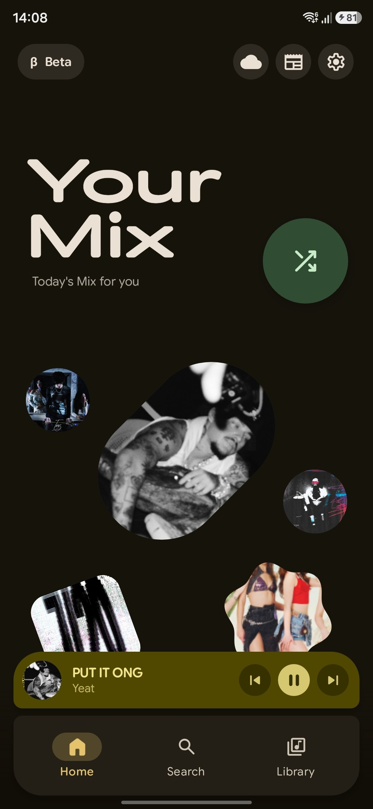
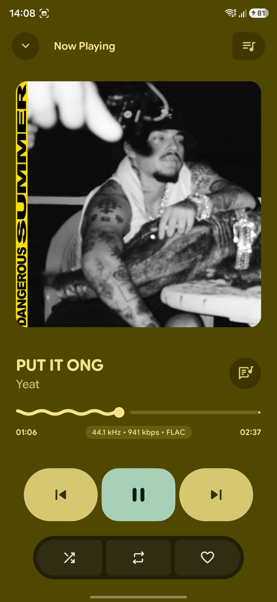
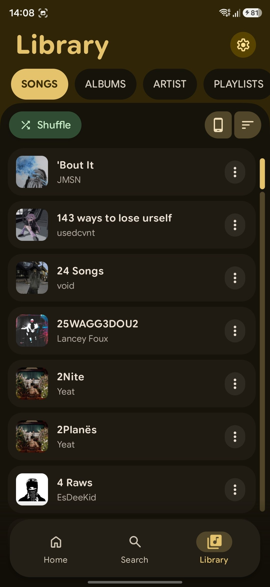
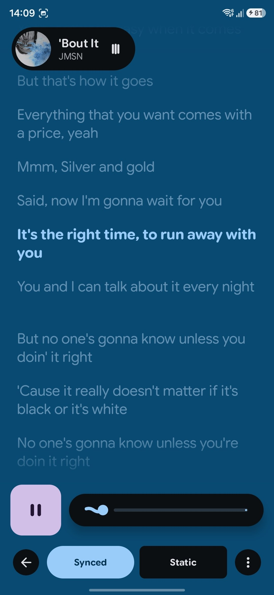

<p align="center">
  
</p>

<p align="center">
  <a href="https://github.com/lostf1sh/Orpheus/releases/latest">
    
  </a>
  <a href="https://f-droid.org/packages/com.yuukifst.orpheus/">
    
  </a>
  <a href="https://github.com/lostf1sh/Orpheus/releases">
    
  </a>
  <a href="https://github.com/sponsors/lostf1sh">
    
  </a>
  
  
</p>

<p align="center">
  
  
  
  
</p>

## Legal Disclaimer

Orpheus is provided for educational and personal-use purposes only. Orpheus is not affiliated with, endorsed by, or sponsored by YouTube or Google. You are solely responsible for how you use the application and for compliance with applicable terms of service and laws in your jurisdiction.

## Build (Nix)

```bash
export NIXPKGS_ALLOW_UNFREE=1
export NIXPKGS_ACCEPT_ANDROID_SDK_LICENSE=1
nix develop --impure
# seed SDK once (see flake shellHook), then:
echo "sdk.dir=$ANDROID_SDK_ROOT" > local.properties
nix build .#default --impure
./result/bin/orpheus-android-fhs ./gradlew assembleDebug -Porcheus.disableReleaseSigning=true
```

Release APKs are named `Orpheus-<version>-<abi>.apk` for [Obtainium](https://github.com/ImranR98/Obtainium) compatibility.

## What It Is

Orpheus is a GPLv3 Android music player forked from [PixelPlayerOSS](https://github.com/PixelPlayerHQ/PixelPlayerOSS). It combines a local music library with YouTube search/streaming (audio-only via embedded NewPipeExtractor), a separate Downloads section, and mixed playlists.

Package name: `com.yuukifst.orpheus`

## Why This Exists

Orpheus keeps the player FOSS-oriented and removes integrations that are not part of that direction.

Removed integrations include Telegram, NetEase, QQ Music, Google Drive, Gemini, Cast, Wear OS, Play Store billing, Firebase, Crashlytics, and Google Play Services runtime dependencies.

Cloud playback is limited to self-hosted sources: Navidrome/Subsonic and Jellyfin.

## Features

| Area | Highlights |
| --- | --- |
| Playback | Media3 playback engine, FFmpeg support, gapless playback, crossfade, custom transitions, queue controls, shuffle, repeat, sleep timer, external file playback |
| Library | Local scanning for MP3, FLAC, AAC, OGG, WAV, M4A, albums, artists, genres, folders, favorites, playlists, stats, metadata editing |
| Self-hosted | Navidrome/Subsonic login, sync, streaming, artwork, Jellyfin login, sync, streaming, artwork |
| Lyrics | Embedded lyrics, local `.lrc` files, lyrics import/editing, optional LRCLIB lookup |
| Artwork | Local artwork, album-art palette extraction, optional Deezer artist image lookup |
| UI | Jetpack Compose, Material 3, dynamic color, light/dark themes, Glance widgets, animated player surfaces |
| Backup | Preferences, playlists, favorites, lyrics, stats, and app state backup/restore |

## Online Services

Orpheus separates offline playback from network lookups.

| Service | Purpose | Default |
| --- | --- | --- |
| Navidrome/Subsonic | Self-hosted library sync and streaming | User login required |
| Jellyfin | Self-hosted library sync and streaming | User login required |
| LRCLIB | Search online lyrics when local or embedded lyrics are missing | Off |
| Deezer | Fetch missing artist artwork and cache it locally | Off |

LRCLIB and Deezer can be enabled during first-run setup or later from `Settings > Music Management > Optional online services`.

## Requirements

| Requirement | Version |
| --- | --- |
| Android | 11 or newer, API 30+ |
| JDK | 21 |
| Android SDK | compile/target 37 |

## Build From Source

Clone the repository:

```sh
git clone https://github.com/lostf1sh/Orpheus.git
cd Orpheus
```

Build the debug APK:

```sh
JAVA_HOME=/usr/lib/jvm/java-21-openjdk ./gradlew :app:assembleDebug
```

Build one universal debug APK for local installation:

```sh
JAVA_HOME=/usr/lib/jvm/java-21-openjdk ./gradlew :app:assembleDebug -Porpheus.enableAbiSplits=false
```

Build a universal unsigned release APK suitable for F-Droid verification:

```sh
JAVA_HOME=/usr/lib/jvm/java-21-openjdk ./gradlew :app:assembleRelease -Porpheus.enableAbiSplits=false -Porpheus.disableReleaseSigning=true
```

Run unit tests:

```sh
JAVA_HOME=/usr/lib/jvm/java-21-openjdk ./gradlew :app:testDebugUnitTest
```

Generate the baseline profile with a connected device or emulator:

```sh
JAVA_HOME=/usr/lib/jvm/java-21-openjdk ./gradlew :baselineprofile:generateBaselineProfile
```

## Download

Orpheus is available on F-Droid:

<a href="https://f-droid.org/packages/com.yuukifst.orpheus/">
  
</a>

GitHub releases are available at:

```text
https://github.com/lostf1sh/Orpheus/releases
```

Obtainium app id:

```text
com.yuukifst.orpheus
```

Public releases are planned on a regular weekly cadence when `main` passes the release checklist.

F-Droid listing metadata lives in `fastlane/metadata/android/en-US`; build/release notes for F-Droid are in [docs/FDROID.md](docs/FDROID.md).

> Note: F-Droid builds and signs its own APKs from source, so they may lag behind GitHub releases while the new version works through the F-Droid build cycle. F-Droid and GitHub APK signatures differ — switching between the two requires an uninstall/reinstall.

## Support

If Orpheus is useful to you, you can support ongoing development through [GitHub Sponsors](https://github.com/sponsors/lostf1sh).

## Project Structure

```text
app/src/main/java/com.yuukifst.orpheus/
- data/             Room, repositories, preferences, services, workers
- di/               Hilt modules and qualifiers
- presentation/     Compose screens, components, navigation, ViewModels
- ui/               Theme and Glance widgets
- utils/            Shared utilities

baselineprofile/      Macrobenchmark and baseline profile generation
```

## Tech Stack

| Area | Technology |
| --- | --- |
| Language | Kotlin |
| UI | Jetpack Compose |
| Design | Material 3 |
| Playback | AndroidX Media3, ExoPlayer, FFmpeg |
| Database | Room |
| Dependency Injection | Hilt |
| Preferences | DataStore |
| Background Work | WorkManager |
| Networking | Retrofit, OkHttp |
| Images | Coil |
| Metadata | TagLib |

## Contributing

Contributions are welcome. Open an issue or pull request with a focused change and include test/build results when possible.

Useful local checks:

```sh
JAVA_HOME=/usr/lib/jvm/java-21-openjdk ./gradlew :app:compileDebugKotlin
JAVA_HOME=/usr/lib/jvm/java-21-openjdk ./gradlew :app:lintDebug
JAVA_HOME=/usr/lib/jvm/java-21-openjdk ./gradlew :app:testDebugUnitTest
```

Release process: [docs/RELEASE.md](docs/RELEASE.md)

F-Droid notes: [docs/FDROID.md](docs/FDROID.md)

Privacy policy: [PRIVACY.md](PRIVACY.md)

Security policy: [SECURITY.md](SECURITY.md)

## License

Orpheus is licensed under the [GNU General Public License v3.0](LICENSE).

Distributed APKs include third-party components under their own licenses. In particular, the optional FFmpeg decoder dependency `org.jellyfin.media3:media3-ffmpeg-decoder` is GPL-3.0; see [THIRD_PARTY_NOTICES.md](THIRD_PARTY_NOTICES.md).

<p align="center">
  Maintained by <a href="https://github.com/lostf1sh">lostf1sh</a>
</p>
